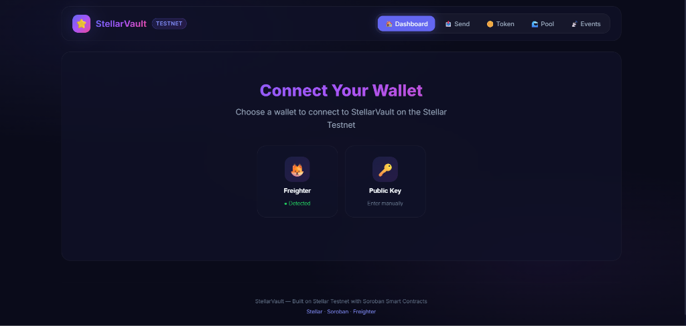
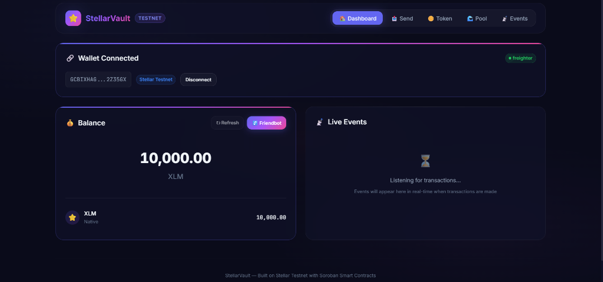
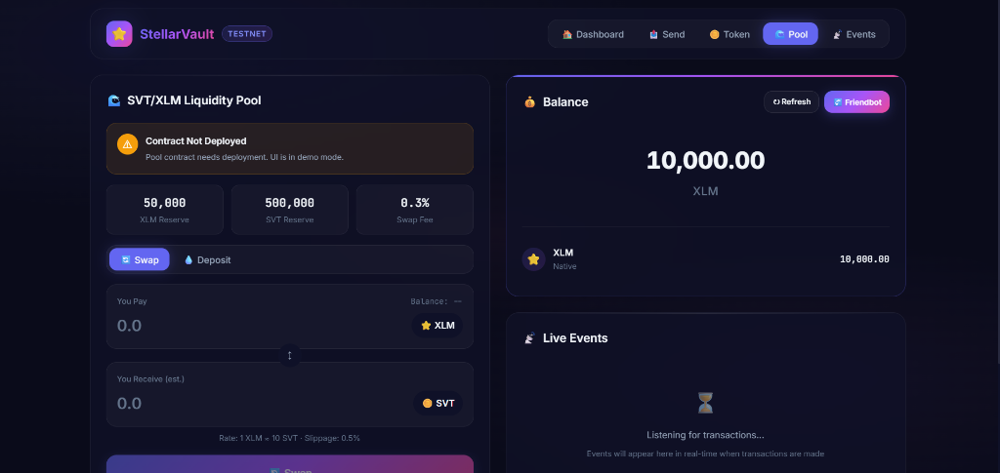

# StellarVault 🌟

> A production-ready Stellar blockchain dApp with multi-wallet support, Soroban smart contracts, custom token, liquidity pool, and real-time event streaming.


[](https://stellar-vault-d-app.vercel.app)

> 🚀 **[Live Deployment → stellar-vault-d-app.vercel.app](https://stellar-vault-d-app.vercel.app)**

### 📱 Open on Mobile — Scan QR Code

[](https://stellar-vault-d-app.vercel.app)

> Point your phone camera at the QR code above to instantly open the live app on mobile.


## 📸 Screenshots

### 🔗 Wallet Connect
> Multi-wallet connection screen with Freighter auto-detection and manual public key entry



### 📊 Dashboard
> Connected wallet view — XLM balance display, Friendbot funding, live event streaming, and full navigation



### 🏊 Liquidity Pool
> SVT/XLM AMM interface with swap & deposit tabs, pool reserves, and real-time balance sidebar



---


## 🏗️ Architecture

```
┌──────────────────────────────────────────┐
│              React Frontend              │
│  (Vite + React 19 + Vanilla CSS)         │
├──────────────────────────────────────────┤
│           Wallet Layer                   │
│  ┌─────────────┐  ┌──────────────┐       │
│  │  Freighter   │  │  Manual Key  │       │
│  └─────────────┘  └──────────────┘       │
├──────────────────────────────────────────┤
│         Stellar SDK Layer                │
│  ┌───────────┐  ┌─────────────────┐      │
│  │  Horizon   │  │   Soroban RPC   │      │
│  │  (Balance, │  │  (Contract      │      │
│  │   Payments) │  │   Invocations)  │      │
│  └───────────┘  └─────────────────┘      │
├──────────────────────────────────────────┤
│       Stellar Testnet Blockchain         │
│  ┌───────────────┐  ┌────────────────┐   │
│  │  SVT Token     │  │  Liquidity     │   │
│  │  Contract      │──│  Pool Contract │   │
│  └───────────────┘  └────────────────┘   │
└──────────────────────────────────────────┘
```

---

## 🚀 Getting Started

### Prerequisites

- **Node.js** ≥ 18
- **npm** ≥ 9
- **Freighter Wallet** — [Install extension](https://www.freighter.app/)
- **Rust + Stellar CLI** (optional, for contract deployment)

### Installation

```bash
# Clone the repository
git clone https://github.com/YOUR_USERNAME/stellar-vault.git
cd stellar-vault

# Install dependencies
npm install

# Start development server
npm run dev
```

The app will be available at `http://localhost:5173`

### Wallet Setup

1. Install the [Freighter browser extension](https://www.freighter.app/)
2. Create or import a wallet
3. Switch to **Testnet** in Freighter settings
4. Fund your wallet using the in-app **Friendbot** button (gives 10,000 XLM)

---

## 🪙 Smart Contracts

### 🌐 Deployed Addresses (Testnet)

- **SVT Token Issuer:** [`GBI67VYGWZPT6QLX6SIDKUJFPDMBEAWTD2A2EKHLOR53UGEKGIRXGMFG`](https://stellar.expert/explorer/testnet/asset/SVT-GBI67VYGWZPT6QLX6SIDKUJFPDMBEAWTD2A2EKHLOR53UGEKGIRXGMFG)
- **Liquidity Pool ID:** [`53f9129e45ce988281ead043f8fcaf488956d6c049c9ac33cb31f24c85c43301`](https://stellar.expert/explorer/testnet/liquidity-pool/53f9129e45ce988281ead043f8fcaf488956d6c049c9ac33cb31f24c85c43301)
- **Deployer Account:** [`GBV6GP2INFWDWAKPMWQKG2H4JFZ3GYDZRG2X2KYT6Z3DXV6IB6LGLQBO`](https://stellar.expert/explorer/testnet/account/GBV6GP2INFWDWAKPMWQKG2H4JFZ3GYDZRG2X2KYT6Z3DXV6IB6LGLQBO)

### Token Contract (SVT)

The StellarVault Token is a custom Soroban token with:
- `initialize()` — Set up token metadata
- `mint()` — Mint new tokens (admin only)
- `transfer()` — Transfer tokens between addresses
- `balance()` — Query token balance
- `approve() / allowance()` — ERC-20-style allowances
- `total_supply()` — Get total minted supply

### Liquidity Pool Contract

A constant-product AMM (x·y=k) with:
- `initialize()` — Set up pool with two tokens
- `deposit()` — Add liquidity and receive LP shares
- `swap()` — Swap tokens with 0.3% fee
- `get_reserves()` — Query pool state
- **Inter-contract calls** to Token contract for token transfers

### Deploying Contracts

```bash
# Prerequisites
curl --proto '=https' --tlsv1.2 -sSf https://sh.rustup.rs | sh
rustup target add wasm32-unknown-unknown
cargo install stellar-cli

# Deploy to testnet
cd contracts
chmod +x deploy.sh
./deploy.sh
```

After deployment, update the contract IDs in `src/utils/constants.js`.

---

## 🧪 Testing

```bash
# Run all tests
npx vitest run

# Run tests in watch mode
npx vitest

# Run with coverage
npx vitest run --coverage
```

### Test Suite

| File | Tests | Description |
|------|-------|-------------|
| `utils.test.js` | 12 | Address validation, balance formatting, error classification |
| `WalletContext.test.jsx` | 3 | Context provider, initial state, error boundaries |
| `WalletConnect.test.jsx` | 3 | Connect UI, wallet options, button rendering |
| `SendTransaction.test.jsx` | 3+ | Form rendering, disabled states, validation |

---

## 🔧 Error Handling

Three distinct error types with user-friendly messages:

| Error Type | Icon | Trigger |
|-----------|------|---------|
| `NetworkError` | 🌐 | Horizon/RPC failures, timeouts, connectivity |
| `InsufficientFundsError` | 💰 | Not enough XLM/tokens, unfunded accounts |
| `ContractError` | 📜 | Contract invocation failures, simulation errors |

All errors are auto-classified from raw exceptions via `classifyError()`.

---

## 🔄 CI/CD

GitHub Actions pipeline runs on every push to `main`:

1. **Lint** — ESLint with React plugin
2. **Test** — Vitest with 14+ tests
3. **Build** — Vite production build
4. **Artifact Upload** — Build artifacts saved for 7 days

See `.github/workflows/ci.yml`

---

## 📱 Mobile Responsive

The app is fully responsive with breakpoints at:
- **1024px** — Single column layout
- **768px** — Stacked header, mobile navigation
- **480px** — Compact buttons, smaller text

---

## 📁 Project Structure

```
stellar-vault/
├── contracts/                    # Soroban smart contracts (Rust)
│   ├── token/src/lib.rs          # SVT Token contract
│   ├── pool/src/lib.rs           # Liquidity Pool contract
│   └── deploy.sh                 # Deployment script
├── src/
│   ├── components/               # React UI components
│   │   ├── WalletConnect.jsx     # Multi-wallet connection
│   │   ├── BalanceCard.jsx       # Balance display + Friendbot
│   │   ├── SendTransaction.jsx   # XLM send form
│   │   ├── TokenPanel.jsx        # SVT token interactions
│   │   ├── PoolPanel.jsx         # Liquidity pool / swap
│   │   └── EventLog.jsx          # Real-time event stream
│   ├── context/
│   │   └── WalletContext.jsx     # Global wallet state
│   ├── hooks/
│   │   └── useStellar.js         # Stellar SDK hooks
│   ├── utils/
│   │   ├── errors.js             # Error types + utilities
│   │   └── constants.js          # Network config
│   ├── __tests__/                # Test suite
│   ├── App.jsx                   # Main app with navigation
│   ├── main.jsx                  # Entry point
│   └── index.css                 # Design system
├── .github/workflows/ci.yml      # CI/CD pipeline
├── index.html                    # HTML entry
├── vite.config.js                # Vite + Vitest config
├── package.json                  # Dependencies
└── README.md                     # This file
```

---

## 🛠️ Tech Stack

| Technology | Purpose |
|-----------|---------|
| React 19 | Frontend framework |
| Vite 8 | Build tool & dev server |
| Vanilla CSS | Premium dark theme design system |
| @stellar/stellar-sdk | Stellar blockchain SDK |
| @stellar/freighter-api | Freighter wallet integration |
| Soroban SDK (Rust) | Smart contract development |
| Vitest | Testing framework |
| GitHub Actions | CI/CD pipeline |

---

## 🎬 Demo

See the [Screenshots](#-screenshots) section above for a visual walkthrough of the app.

**Key Demo Flow:**

1. 🔗 **Connect Wallet** — Choose Freighter (auto-detected) or enter a public key manually
2. 📊 **View Dashboard** — See real-time XLM balance and live event stream
3. 💰 **Fund with Friendbot** — Get 10,000 testnet XLM instantly
4. 💸 **Send XLM** — Execute transactions with full status tracking (building → signing → submitting)
5. 🪙 **Token Panel** — Mint, transfer, and query SVT token balances via Soroban
6. 🏊 **Liquidity Pool** — Swap XLM ↔ SVT using the AMM with 0.3% fee
7. 📡 **Live Events** — Watch real-time transaction events as they happen

---

## 📄 License

MIT License — see [LICENSE](LICENSE) for details.

---

## 🤝 Contributing

1. Fork the repository
2. Create a feature branch: `git checkout -b feature/amazing-feature`
3. Commit changes: `git commit -m 'feat: add amazing feature'`
4. Push to branch: `git push origin feature/amazing-feature`
5. Open a Pull Request

---

Built with ❤️ on the [Stellar Network](https://stellar.org)
